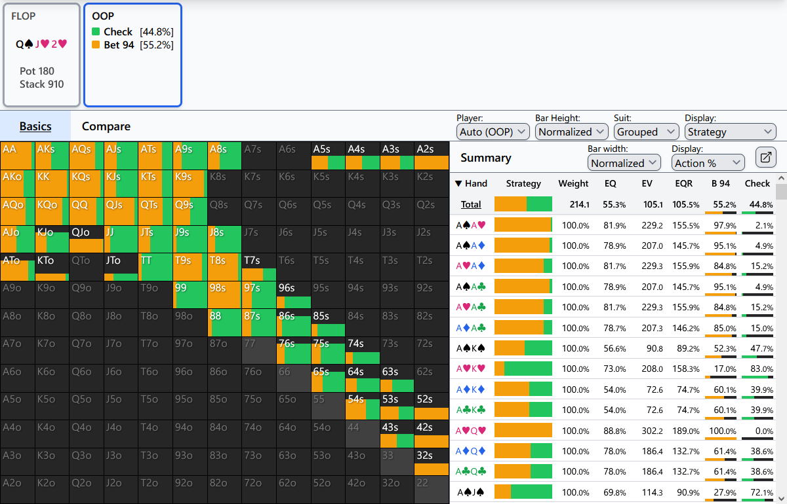

# WASM Postflop

**WASM Postflop** is a free, open-source GTO solver for Texas hold'em poker that works on web browsers.

Website: https://wasm-postflop.pages.dev/

Desktop app **(new!)**: https://github.com/b-inary/desktop-postflop

Solver engine repository: https://github.com/b-inary/postflop-solver


## Why WASM Postflop?

The GTO (Game Theory Optimal) solver has become an indispensable tool for poker research.
However, unfortunately, there is a high barrier to trying out the GTO solver: the need to purchase expensive commercial software.
This project aims to overcome this situation by developing a free, open-source GTO solver.

Please note that this project does not intend to *replace* commercial GTO solvers.
They are great software, and it is not easy to create a new one that can compete with them.
This project intends to make the GTO solver more easily accessible to a broader audience.

### Features

- **Free to use**.
  The most important feature.
  Anyone can try out the solver for free!

- **Open source**.
  The implementation of the GTO solver is complicated and is not easy to write down accurately.
  By making the program open source, we make it possible for anyone to examine the implementation.

- **Works on web browsers**.
  This feature brings several advantages.
  First, it allows for the solver to be easily accessible.
  Second, it naturally makes the solver a cross-platform application.
  Finally, it sandboxes the solver execution, so users do not have to worry about security.

- **Sufficiently fast**.
  Slow solvers are not wanted.
  By using WebAssembly, we have reduced the performance penalty of being a web application.
  We also supported multithreading and used a state-of-the-art algorithm ([Discounted CFR]).

[Discounted CFR]: https://arxiv.org/abs/1809.04040

## Comparison

We tested [PioSOLVER Free] (2.0.8), [GTO+] (v1.4.1), WASM Postflop, and [Desktop Postflop] with the "3betpotFAST" preset of PioSOLVER (all-in threshold is replaced with 100% in PioSOLVER).

[PioSOLVER Free]: https://www.piosolver.com/
[GTO+]: https://www.gtoplus.com/
[Desktop Postflop]: https://github.com/b-inary/desktop-postflop

### Execution time and memory usage

We experimented on a Windows 10 PC with a Ryzen 7 3700X CPU (16 threads; PioSOLVER Free is limited to 6 threads).
WASM Postflop was executed on Google Chrome 103.
WASM Postflop is slower than Pio CFR and GTO+, but it is not so inferior to these commercial solvers despite being a web application.

[1]: Pio CFR / [2]: Original Pio algorithm / [3]: No compression / [4]: Use compression

| Solver | PioSOLVER<br/>2.0.8 [1] | PioSOLVER<br/>2.0.8 [2] | GTO+<br/>v1.4.1 | WASM<br/>[3] | WASM<br/>[4] | Desktop<br/>v0.0.2 [3] | Desktop<br/>v0.0.2 [4] |
| :---: | :---: | :---: | :---: | :---: | :---: | :---: | :---: |
| **Time (Target = 0.5%)** | 23.36 s | 31.23 s | 14.15 s | 31.90 s | 37.96 s | 16.23 s | 18.41 s |
| **Time (Target = 0.3%)** | 28.68 s | 43.87 s | 19.87 s | 39.57 s | 47.39 s | 20.21 s | 22.82 s |
| **Time (Target = 0.1%)** | 61.13 s | 110.47 s | 42.66 s | 70.98 s | 84.81 s | 36.22 s | 40.53 s |
| **Memory usage** | 1.41 GB | 634 MB | 705 MB | 1.21 GB | 640 MB | 1.22 GB | 659 MB |

### Results

A comparison of the obtained results is as follows (target exploitability is set to 0.1%).
We can see that PioSOLVER, GTO+, and WASM Postflop return nearly identical results.

| PioSOLVER | GTO+ | WASM Postflop |
| --- | --- | --- |
|  |  |  |

**Summary for those who do not want to compare images:**

| Solver | PioSOLVER | GTO+ | WASM Postflop |
| :---: | :---: | :---: | :---: |
| **Bet %** | 55.19% | 55.2% | 55.2% |
| **Equity** | 55.347% | 55.35% | 55.3% |
| **EV** | 105.11 | 105.115 | 105.1 |

## Build

```sh
$ # prerequisites
$ rustup install nightly
$ rustup component add rust-src --toolchain nightly
$ rustup target add wasm32-unknown-unknown
$ cargo install wasm-pack
$ npm install

$ # build
$ npm run wasm  # the latest version of binaryen (wasm-opt) may need to be installed
$ npm run build

$ # serve
$ npm run serve

$ # lint/format
$ npm run lint
$ npm run format
```

## License

Copyright (C) 2022 Wataru Inariba

This program is free software: you can redistribute it and/or modify it under the terms of the GNU Affero General Public License as published by the Free Software Foundation, either version 3 of the License, or (at your option) any later version.

This program is distributed in the hope that it will be useful, but WITHOUT ANY WARRANTY; without even the implied warranty of MERCHANTABILITY or FITNESS FOR A PARTICULAR PURPOSE.  See the GNU Affero General Public License for more details.

You should have received a copy of the GNU Affero General Public License along with this program.  If not, see <https://www.gnu.org/licenses/>.
